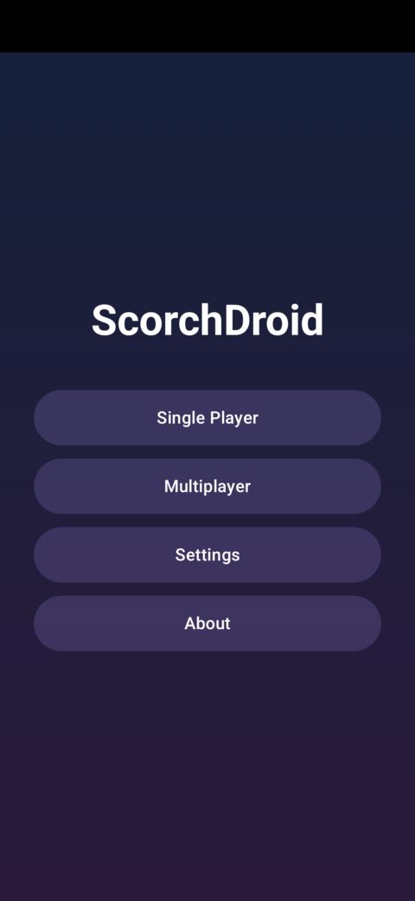
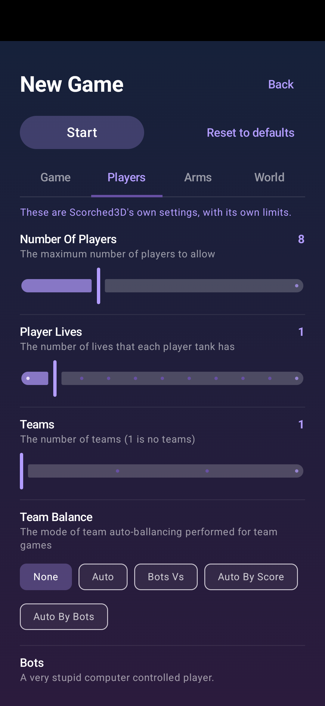
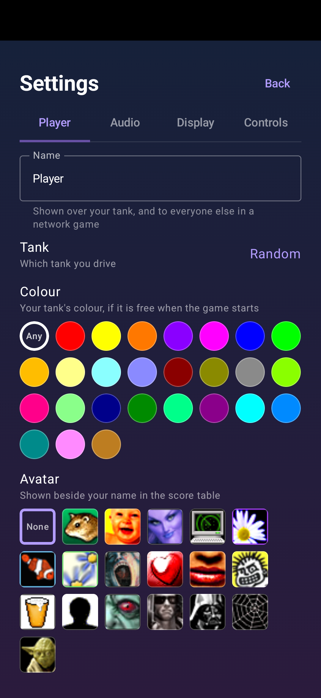
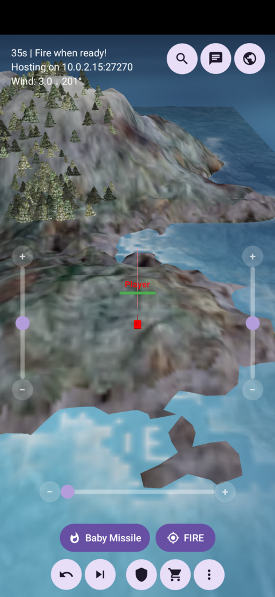
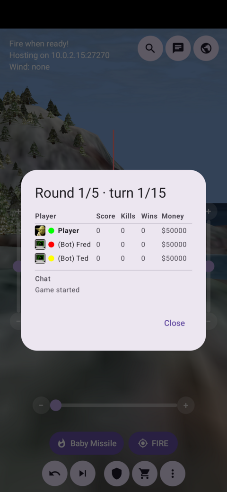

# ScorchDroid

ScorchDroid is an Android port of [Scorched3D](https://www.scorched3d.co.uk/), the 3D
artillery game, based on the classic Scorched Earth. 
It is built on [bberberov/scorched3d](https://github.com/bberberov/scorched3d), a maintained fork of the original source.

This port uses Scorched3D's ballistics, weapons, terrain deformation, economy, AI, and network protocol code along with the original rules. The interface is fresh, made with Jetpack Compose and OpenGLES3 designed for a touch phone screen instead of a PC with mouse and keyboard. 

It is in a playable state now with most of the graphics and gameplay implemented but will be iterated upon until it meets parity (or as close as we can get) with the original game.

Cheers, enjoy! rm

    

## Features

- The real Scorched3D simulation, not an approximation: upstream's weapons, accessories, terrain
  destruction, wind, shields, parachutes, tank movement, and bot AI.
- Scorched3D's own picture, method for method: the landscape from the real heightmap with the
  ground texture built the way upstream builds it, its detail texture and its light; a Tessendorf
  ocean with choppy crests that grow with the wind, whitecaps, breakers along every shore, and the
  whole scene reflected in it; the sun as a positional light with its shadow map; the sky dome with
  the landscape's own gradient, clouds, sun, stars and fog; tanks, scenery, ships and aircraft in
  their own textures and materials; trees; cavern roofs; rain and snow where a landscape asks.
- Weapon effects driven by the simulation's own events, drawn with Scorched3D's own particle
  textures and animations — explosions, napalm, lasers, lightning, shield hits, sky flashes,
  teleports, smoke that streams downwind, mushroom clouds, thrown debris, arena wall flashes,
  floating damage numbers and speech bubbles.
- Scorched3D's own sound and music: its effects raised from the simulation's own events, and its
  three loops keyed to the state of the game by its own `music.xml`.
- Touch controls: drag to orbit, pinch to zoom, tap to aim, plus angle/elevation/power sliders and
  a Fire button that don't depend on screen-to-world mapping.
- Seven camera views including a shot camera that follows the projectile.
- Multiplayer — host or join over Wi-Fi, a hotspot, or Wi-Fi Direct, with
  automatic game discovery. Wi-Fi Direct needs no router, hotspot or internet
  at all.
- In-game chat and a live score table, with each player's avatar, their tank colour and — in a team
  game — the team totals.
- The full shop: weapons and defensive accessories, with purchases acknowledged immediately.
- A main menu — single player, multiplayer, and an About screen carrying the GPL notice and the
  exact upstream commit the build came from. Games can be left and started again without
  restarting the app.
- A tutorial over a real practice game, and Quick Game: the ready-made games each mod describes in
  its own `modinfo.xml` — target practice, easy, normal and hard, for the base game and for any mod
  installed beside it.
- A setup screen before each game, in four tabs: the shape of the game, the players, the arsenal
  and the world. Rounds, turns, lives, teams, the bots and how good they are, money, arms levels,
  weapon speed, gravity, walls and wind — Scorched3D's own options, with its own limits, read from
  the engine rather than redeclared.
- Mod support, including the bundled Apocalypse mod with its own weapons, landscapes, models and
  bots.
- A settings screen in four tabs: who you are (name, tank model, colour and avatar), sound and
  music, what is drawn, and how the controls behave, including left-hand mode.
- Portrait and landscape, switchable mid-game.

## Requirements

- Android Studio (recent stable) with the NDK, or a JDK-configured Gradle.
- minSdk 26 / targetSdk 37, `arm64-v8a` and `x86_64`.
- Submodules are required — the upstream source and its dependencies are not vendored into this
  repository:

```
git clone --recurse-submodules https://github.com/roge-rm/ScorchDroid.git
```

## Building & testing

```
./gradlew installDebug      # build and install the debug APK
./gradlew assembleRelease   # build the release APK
```

Upstream's `data/` directory (weapon and landscape XML, tank meshes, language strings) is bundled
straight from the submodule at build time rather than duplicated into this repository, and is
extracted to internal storage on first run — upstream's file I/O uses plain `fopen()` on paths, not
`AAssetManager`.

Game logic is verified on the host, not the emulator:

```
cd host-tests/build && cmake .. && make && ./host_tests
```

That target builds the same `src/common` + `src/server` sources natively and runs over 200 checks
against the real engine — including a full two-process client/host join over real TCP sockets. It
runs in seconds, which is why it, rather than an emulator, is where behaviour is pinned down.

## Architecture

- `third_party/scorched3d/` — upstream, as a submodule pinned to an exact commit. **Never edited
  directly.**
- `patches/scorched3d/` — the eighteen patches applied to that checkout on every build, and the
  tracked record of every change made to upstream. Most are *hooks*: upstream guards its
  presentation work behind `#ifndef S3D_SERVER`, and this build is one that *is* `S3D_SERVER` but
  still has a renderer and a speaker, so each patch adds the smallest possible `#else` beside an
  existing split and puts the real work in `porting/`. They add no game logic.
- `app/src/main/cpp/porting/` — the Android-side half of those hooks, plus the portability shims
  (SDL socket/thread compat) and the pieces of upstream's client layer that had to be rewritten
  because they were unusable: the landscape texture generator, the sky description, and the
  standalone `ClientContext` that replaces `ScorchedClient`.
- `app/src/main/cpp/jni/` — `engine_jni.cpp` (the game-state and control surface) and
  `renderer_jni.cpp` (the whole GLES3 renderer: terrain, water, sky, shadows, models, effects,
  camera).
- `app/src/main/java/com/rm/scorchdroid/` — the Compose UI (`GameHud`, `HudDialogs`), the
  `GLSurfaceView` host and touch handling (`MainActivity`, `GameRenderer`), the JNI declarations
  (`NativeBridge`), LAN discovery, sound, and first-run asset extraction.
- `host-tests/` — a plain CMake project building the same engine natively, with an assert-based
  runner.
- `dedicated-server/` — a standalone Linux server built from the same sources, for testing real
  cross-machine play.

Two conventions are worth knowing before reading the renderer, because both have caused real bugs
here: the engine's fire angle is measured **counter-clockwise** while wind and sun bearings are
clockwise compass angles; and engine coordinates `(x, y, height)` map to world `(x, height,
mapHeight − y)`, subtracting rather than negating so the world stays in the same box.

## Attribution

- Scorched3D is Copyright (C) 2000-2011 Gavin Camp and contributors, from
  [scorched3d.co.uk](https://www.scorched3d.co.uk/). This port builds on the maintained fork at
  [bberberov/scorched3d](https://github.com/bberberov/scorched3d).
- The game's data files, models, textures and sounds are upstream's, bundled unmodified.
- Ported to Android, with a from-scratch OpenGL ES 3 renderer and a new Compose UI, by rm.

## License

GNU General Public License v2 (or later) — see [LICENSE](LICENSE), matching the upstream project.
