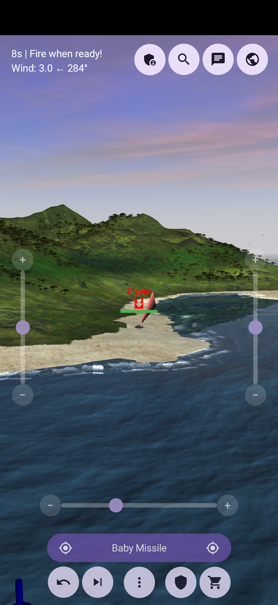
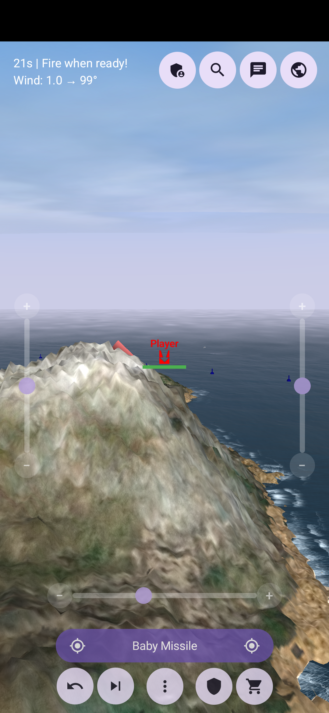
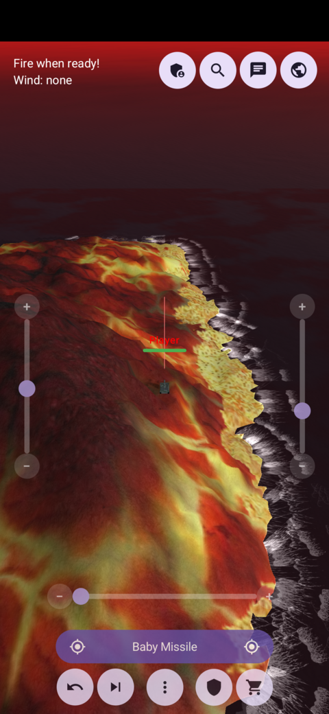

# ScorchDroid

ScorchDroid is an Android port of [Scorched3D](https://www.scorched3d.co.uk/), the 3D artillery game, based on the classic Scorched Earth. 
It uses [bberberov/scorched3d](https://github.com/bberberov/scorched3d) as an upstream source (you'll see upstream referred to constantly) and even boasts cross-compatability with it, at least currently.

The entire game engine was ported over from Scorched3D so it plays the same as the original game. The UI has been totally redone but the graphics are *mostly* the same. The controls have been adapted to work on a touch screen, with sliders and touch buttons to provide the controls the keyboard used to.

Effort has been made to bring every feature from the desktop game to the mobile port, from graphics to audio to network play. Additional network options have been added, allowing you to play over Bluetooth or Ad-Hoc WIFI networks on top of regular WLAN play.

Requires Android 8.0 or higher.

Questions, bug reports, suggestions, looking for people to play with? Check out the #scorchdroid channel **[on my discord](https://discord.gg/9Wun47jGC6)**.

Enjoy!
Dan

  

  

## Features

- The real Scorched3D game engine, not a remake. Weapons, accessories, terrain destruction, wind,
  shields, parachutes, tank movement and the bots all work exactly like they do on desktop.
- The graphics are rebuilt to match the original as closely as possible. That includes the
  landscape and its textures, the ocean with waves that grow with the wind and reflect the whole
  scene, sun shadows, the sky with its clouds, stars and fog, the tank, ship and scenery models,
  trees, and rain and snow on the maps that have them.
- Weapon effects use Scorched3D's particle textures and animations, so explosions, napalm, lasers,
  lightning, shield hits, smoke, mushroom clouds and the rest look like they should.
- Sound and music are from Scorched3D and mixed the same way it does it, along with the turn
  countdown and the turret servo sound.
- Touch controls: drag to move the camera, pinch to zoom, tap to aim, plus sliders for angle,
  elevation and power. One big bar fires your shot (tap) and picks your weapon (hold), and it turns
  red once your shot is in.
- Seven camera views, including one that follows your shot.
- Multiplayer over Wi-Fi, a hotspot, Wi-Fi Direct or Bluetooth, and games are found automatically.
  Wi-Fi Direct and Bluetooth don't need a router or internet, so two phones side by side can play
  anywhere. Single player games don't broadcast anything.
- You can also join a **desktop Scorched3D server** and play with people on PC, just enter the
  server's address under Join Game. This works because the port uses Scorched3D's own network code
  and data unchanged, and it only holds as long as both sides are on the same version (44.3 /
  "ew"). `host_tests` checks both so I'll know if it ever breaks.
- In-game chat and a live score table with avatars, tank colours and team totals.
- Admin controls for the host: kick, ban, mute, slap, take money, kill, start a new game or clear
  the map.
- A **dedicated server** you can run on a spare machine with `docker compose up`, with a web page
  to manage its settings, players, chat and log. Phones on the same network find it on their own.
  See [dedicated-server/README.md](dedicated-server/README.md).
- The full shop with weapons and defenses, plus giving money to other players.
- Save a game you're hosting and load it later, solo or with other people.
- Skip all your turns if you need to walk away, with a five second countdown each turn so you can
  change your mind.
- Hold a tank's name to see its life, shield, lives, score, skill and rank.
- A tutorial on a real practice game, and Quick Game with ready-made games (target practice, easy,
  normal and hard) for the base game and any installed mods.
- A setup screen for new games with all of Scorched3D's options: rounds, turns, lives, teams,
  bots, money, weapons, gravity, walls, wind, maps and more.
- Mod support, including the Apocalypse mod which comes bundled.
- Settings for your name, tank, colour and avatar, sound and music, graphics, and controls
  (including left-hand mode).
- Portrait and landscape, and you can switch mid-game.

## Installing

The easiest way to install ScorchDroid and keep it up to date is through my F-Droid repo:

[https://roge-rm.gitlab.io/repo](https://roge-rm.gitlab.io/repo?fingerprint=80438B253C257BCCE05CDCB9E3AC9B6174C2250659962B14FCBE7F32FD42D53E)

Then search for ScorchDroid in F-Droid. When a new version comes out, F-Droid will offer it as an update.

You can also download the APK from the [Releases](https://github.com/roge-rm/ScorchDroid/releases)
page and sideload it. 

## Dedicated server

If you want a game that's always up you can run a **dedicated server** on a spare machine. It's
the same engine without the graphics and sound, so both ScorchDroid and desktop Scorched3D 44.3
players can connect to it. It comes with a web admin page where you can change any setting, manage
players (kick, ban, mute etc.), watch the log and chat, and restart the server. Phones on the same
network will find it on their own.

It runs as two containers and you don't need to clone anything, the compose file builds straight
from this repo:

```bash
curl -O https://raw.githubusercontent.com/roge-rm/ScorchDroid/master/dedicated-server/docker-compose.yml
echo 'ADMIN_PASSWORD=pick-something' > .env
docker compose up -d --build
```

Setup, config, mods and backups are covered in **[dedicated-server/README.md](dedicated-server/README.md)**.
If you're curious how it's built, see [docs/dedicated-server.md](docs/dedicated-server.md).

## Requirements

- Android Studio (recent stable) with the NDK, or Gradle with a JDK set up.
- minSdk 26 / targetSdk 37, `arm64-v8a` and `x86_64`.
- The submodules, since the upstream source and its dependencies aren't copied into this repo:

```
git clone --recurse-submodules https://github.com/roge-rm/ScorchDroid.git
```

## Building & testing

```
./gradlew installDebug      # build and install the debug APK
./gradlew assembleRelease   # build the release APK
```

Upstream's `data/` folder (weapons, maps, models, language files) gets bundled from the submodule
at build time and extracted to the phone's storage on first run, since upstream reads its files
with plain `fopen()`.

Game logic is tested on the computer instead of the emulator:

```
cd host-tests/build && cmake .. && make && ./host_tests
```

That builds the same engine code natively and runs over 400 checks against it, including a full
client joining a host, once over TCP and once over the same socket bridge Bluetooth uses. It only
takes a few seconds.

The dedicated server can be built on its own too:

```bash
cmake -S dedicated-server -B build/server -DCMAKE_BUILD_TYPE=Release
cmake --build build/server -j
./build/server/dedicated_server --help
```

Or as the two containers, which is how it's meant to be run: `cp .env.example .env`, set
`ADMIN_PASSWORD`, then `docker compose up --build`.

## Architecture

- `third_party/scorched3d/` - upstream, as a submodule pinned to a specific commit. **Never edited
  directly.**
- `patches/scorched3d/` - the twenty-three patches applied to upstream on every build, and the
  record of every change made to it. Most of them just add small hooks so the port can do its own
  drawing and sound. None of them change how the game plays.
- `app/src/main/cpp/porting/` - the Android side of those hooks, some compatibility shims (SDL
  sockets and threads), and the parts of upstream's client that had to be rewritten: the landscape
  texture generator, the sky, and `ClientContext`, which replaces `ScorchedClient`.
- `app/src/main/cpp/jni/` - `engine_jni.cpp` (game state and controls) and `renderer_jni.cpp` (the
  whole GLES3 renderer).
- `app/src/main/java/com/rm/scorchdroid/` - the Compose UI (`GameHud`, `HudDialogs`), the
  `GLSurfaceView` and touch handling (`MainActivity`, `GameRenderer`), the JNI bindings
  (`NativeBridge`), LAN discovery, sound, and extracting the game data on first run.
- `host-tests/` - a plain CMake project that builds the engine natively and runs the tests.
- `dedicated-server/` - the standalone Linux server, with its own CMake project, `main.cpp`, and
  `ControlServer.cpp`, which is how the web admin talks to it. It doesn't touch the game's network
  protocol.
- `cmake/ScorchedCommon.cmake` - the `scorched_common` library, shared by `host-tests/` and
  `dedicated-server/`.
- `web-admin/` - the server's web admin page, built with FastAPI, Jinja and htmx.
- `docker/`, `docker-compose.yml` - the two images and how they run together.

Two things worth knowing before digging into the renderer, because both have caused bugs: the
engine's fire angle goes **counter-clockwise** while wind and sun directions are clockwise compass
angles, and engine coordinates `(x, y, height)` map to world `(x, height, mapHeight - y)`.

## Discussion and support

Questions, ideas, bug reports, looking for someone to play with?<br>
Check out the #scorchdroid channel **[on my discord](https://discord.gg/9Wun47jGC6)**.

## Attribution

- Scorched3D is Copyright (C) 2000-2011 Gavin Camp and contributors, from
  [scorched3d.co.uk](https://www.scorched3d.co.uk/). This port is built on the maintained fork at
  [bberberov/scorched3d](https://github.com/bberberov/scorched3d).
- The game's data files, models, textures and sounds are all from Scorched3D, unmodified.
- Ported to Android, with a new OpenGL ES 3 renderer and UI, by Dan Hunke.

## License

GNU General Public License v2 (or later), same as Scorched3D. See [LICENSE](LICENSE).
